## Table of Content
- [Introduction](#introduction)
  - [Built With](#built-with)
  - [Main components](#main-components)
  - [Launch and Deployment](#launch-and-deployment)
      - [Cloning the repository](#cloning-the-repository)
      - [Locally](#locally)
      - [Cloud service](#cloud-service)
  - [Illustrations](#illustrations)
    - [Login and register](#login-and-register)
    - [Case: Create game](#case-create-game)
    - [Case: Join game](#case-join-game)
    - [Social features](#social-features)
    - [User Profile](#user-profile)
    - [During the game:](#during-the-game)
    - [Logout](#logout)
  - [Roadmap (next steps)](#roadmap-next-steps)
  - [Authors](#authors)
  - [Acknowledgments](#acknowledgments)
  - [License](#license)
  - [References](#references)
    - [Exploding Chickens Card Images](#exploding-chickens-card-images)
    - [Usage of Project Materials](#usage-of-project-materials)

# Introduction

Exploding Chickens is a spin-off of the popular game 'Exploding Kittens'. In this version, the protagonists are lovely chickens (but not so lovely, they can explode!). We created this unique implementation to conect people through a web implementation of this game, as previously it was only possible to play  when players were co-located.

This project offers an innovative user interface and features that enhance collaboration between players while providing a good user experience. These features include the ability to send friend requests, a chat to discuss strategies, and high-quality graphics.

## Built With
* [React](https://react.dev/) - Front-end JavaScript library
* [MUI](https://mui.com/) - React component library
* [Spring](https://spring.io/projects/spring-framework) - Java Back-end framework
* [Gradle](https://gradle.org/) - Build automation tool
* [STOMP](https://stomp-js.github.io/stomp-websocket/) - Bidirectional real time communication over websockets
* [DeckOfCardsAPI](https://www.deckofcardsapi.com/) - External API to simulate card decks
* [PerspectiveAPI](https://www.perspectiveapi.com/) - External API for content moderation (checking usernames and emails for toxicity)
* [GmailAPI](https://developers.google.com/gmail/api/reference/rest) - External API for email interaction for password reset
* [PostgreSQL](https://www.postgresql.org/) - Persistent Database (through instance of CloudSQL)

## Main components
-  [Game.tsx](https://github.com/sopra-fs24-group-17/client/blob/develop/src/components/views/Game.tsx): This view is what the player sees when they play a game of exploding kittens. It is the main part of our application and this is where most of the magic happens. The most important part here is the Websocket connection to the server, which handles all game-related logic. 
-  [Chat.tsx](https://github.com/sopra-fs24-group-17/client/blob/develop/src/components/views/Chat.tsx): The chat view enables users to communicate with each other while playing a game. 
-  [WebsocketConnection.tsx](https://github.com/sopra-fs24-group-17/client/blob/develop/src/helpers/WebsocketConnection.tsx): This helper file is used in many views to facilitate the websocket connection. It is responsible for connecting and disconnecting to the server, as well as subscribing and unsubscribing to channels and sending messages. 
-  [AllPlayers.tsx, EnemyPlayers.tsx, Friends.tsx](https://github.com/sopra-fs24-group-17/client/blob/develop/src/components/views/AllPlayers.tsx): These views allow users to check out who else is playing Exploding Kittens, send friend requests and look at game related statistics. 
-  [Profile.tsx](https://github.com/sopra-fs24-group-17/client/blob/develop/src/components/views/Profile.tsx): Here, users can view their own profile and change things like their profile image, their country as well as their e-mail and password. 

## Launch and Deployment
#### Cloning the repository
`git clone https://github.com/sopra-fs24-group-17/client.git`\
`cd client`

#### Locally
- Build : `npm run build dev`
- Run : `npm run dev`
- Install dependencies: `npm install`

You can verify that the server is running by visiting `localhost:8080` in your browser. By default the development profile is active, utilizing an in-memory H2 database.
You can access the local hosted application (client) by visiting `localhost:3000`

NOTE: The server repository can be found [here](https://github.com/sopra-fs24-group-17/client)

#### Cloud service
- through GitHub workflows, the main branch is automatically deployed onto Google Cloud's App Engine
- during deployment, the in-memory H2 database is migrated to a CloudSQL instance of PostgreSQL
  - (Note: if changes to the database schema are done, the database must be restarted upon deployment)
- during deployment, credentials for Google App Engine, PostgreSQL and the Gmail API are replaced with GitHub secrets

## Illustrations
### Login and register
The user flow is as follows:
1. An existing user logs in and a new user registers to the platform.
2. The user is redirected to the main dashboard where it is possible to create a new game, join to a existing one, go to user's profile, use the social features, or logout.

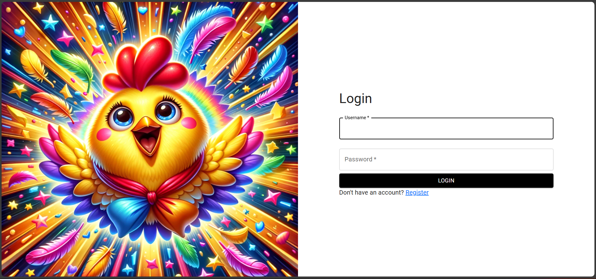
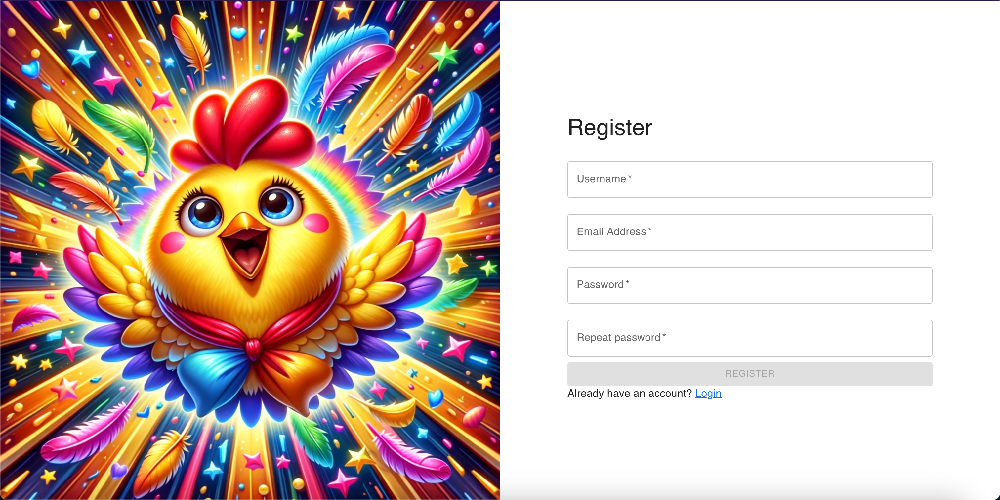

### Case: Create game
1. The user can select the game configuration (private or public and number of players). By clicking the `SETUP GAME` button the game lobby is started where users can join and can be started once the number of players is reached. 

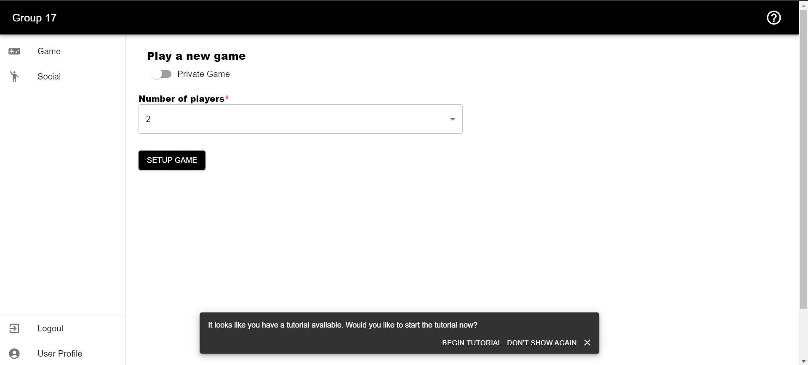
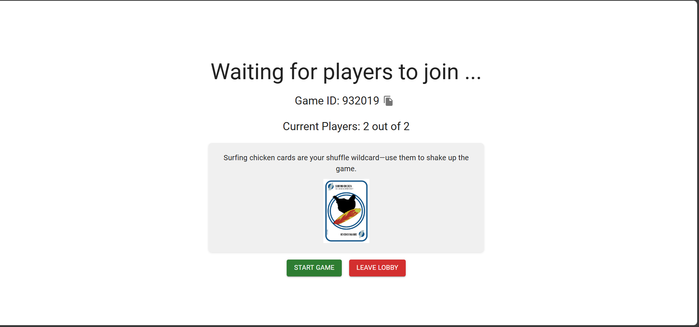

### Case: Join game
1. The join game view will display the public available games, the user can either join a public game by clicking the join button or join a private game by entering the game id of the private game.

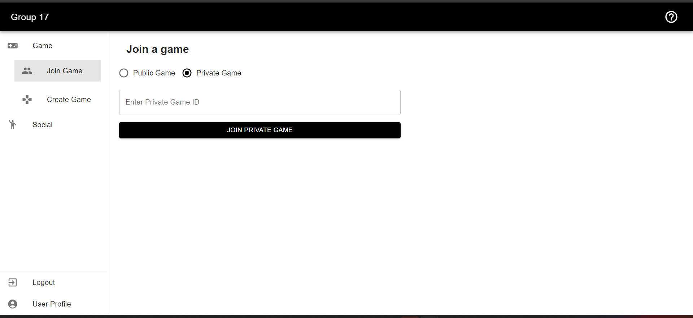

### Social features
1. All players view will display all existing players. The user can search here for specific players, see their statistics, and add them to their friends network.
2. The friends view will display all the friends of the user, where the user can see if they are online and their avatar.

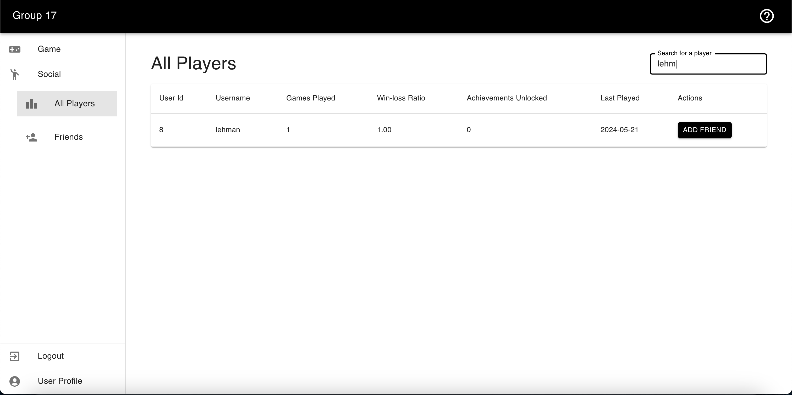
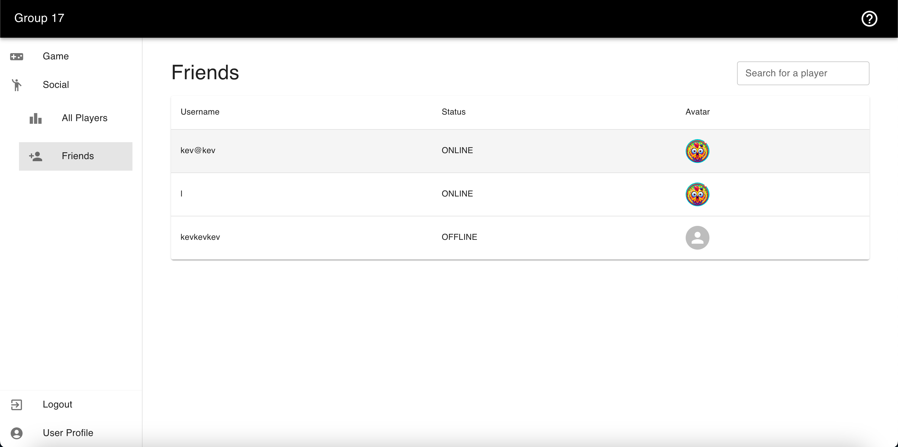

### User Profile
1. The user profile shows the data given by the user upon registration and enables the user to modify this data, as well as completing their profile by adding an avatar, birthday, among others.

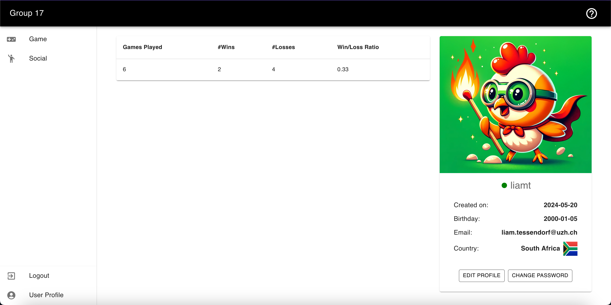

### During the game:
1. The user can see in the top of the window who is the active player. When the user is the active player they can play their move cards (visible in their hand) and end their turn by grabing a card from the dealer pile (upside down cards).
2. The player can access the tutorial by clicking the `?` icon at any time of the game.
3. The player can interact with other players during the game by clicking the chat icon, which will pop out the chat.
4. The player can leave the game earlier by clicking the exit icon.
5. Upon completion of the game, a leaderboard with the position of the players will be displayed and users can go back to the home view.
   
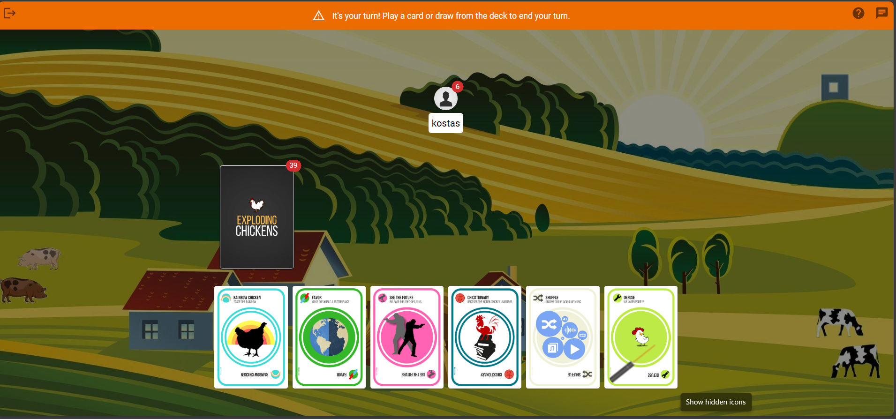
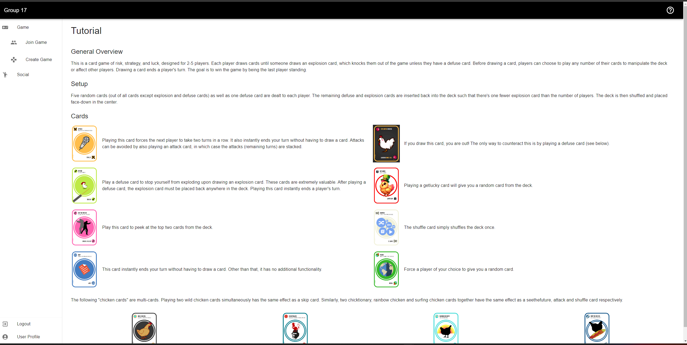
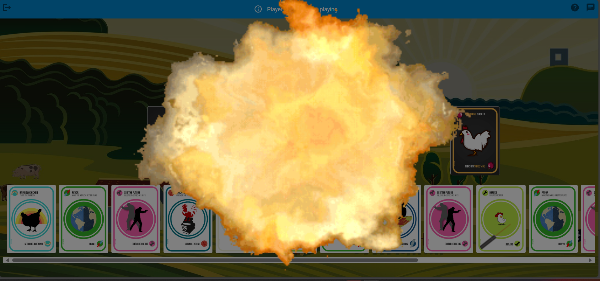
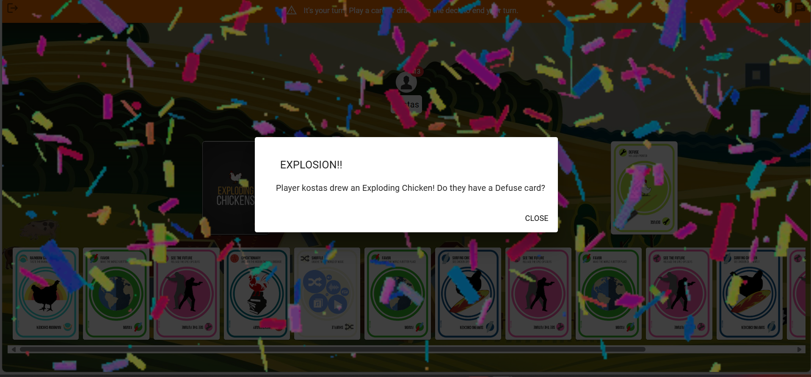
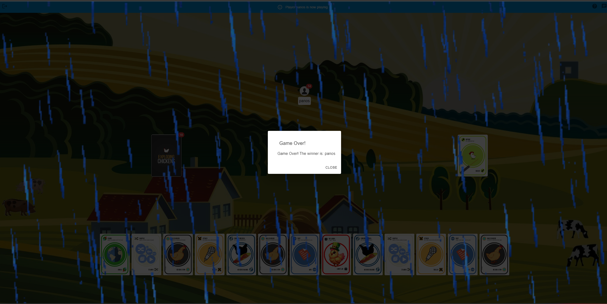

### Logout
1. Ends user session.

## Roadmap (next steps)
Below is an outline of suggestive features that developers who want to contribute to our project could use as a starting point:
- new game modes, e.g higher probability of explosions and new custom game cards
- implementation of a mobile application
- in game store to allow customization of user profiles and avatars

## Authors
* **Liam Tessendorf** - (*Frontend*) - [liamti5](https://github.com/liamti5)
* **Liam Kane** - (*Frontend*) - [ljkane](https://github.com/ljkane)
* **Panagiotis Patsias** - (*Frontend*) - [PanagiotisPatsias](https://github.com/PanagiotisPatsias)
* **Jorge Ortiz** - (*Backend*) - [jorgeortizv](https://github.com/jorgeortizv)
* **Kevin Bründler** - (*Backend*) - [random9ness](https://github.com/random9ness)

## Acknowledgments
We would like to thank the professor and tutors of the Software Engineering Lab course from the Univeristy of Zurich.
A special thanks to our tutor [feji08](https://github.com/feji08) for the weekly meetings and continuous support.

## License
This project is licensed under the MIT License. For more details, see the [LICENSE](https://github.com/sopra-fs24-group-17/server/blob/main/LICENSE.txt) file.

## References
### Exploding Chickens Card Images
- **Project:** Exploding Chickens Game Cards
- **Author:** Radison Akerman, Sengdao Inthavong, Vincent Do, Richard Yang
- **Source:** [GitHub Repository](https://github.com/jeffuntalan/exploding-chickens)
- **License:** Mozilla Public License 2.0 (MPL 2.0)
- **License Details:** This project is protected under the MPL 2.0. For more details, see the [LICENSE file](https://github.com/rak3rman/exploding-chickens/blob/main/LICENSE) in the repository.

### Usage of Project Materials

- The project's materials, meaning the game cards images, are utilized according to the terms of the Mozilla Public License 2.0.
- Any modifications made to the original materials are clearly documented and attributed to the modifier.

